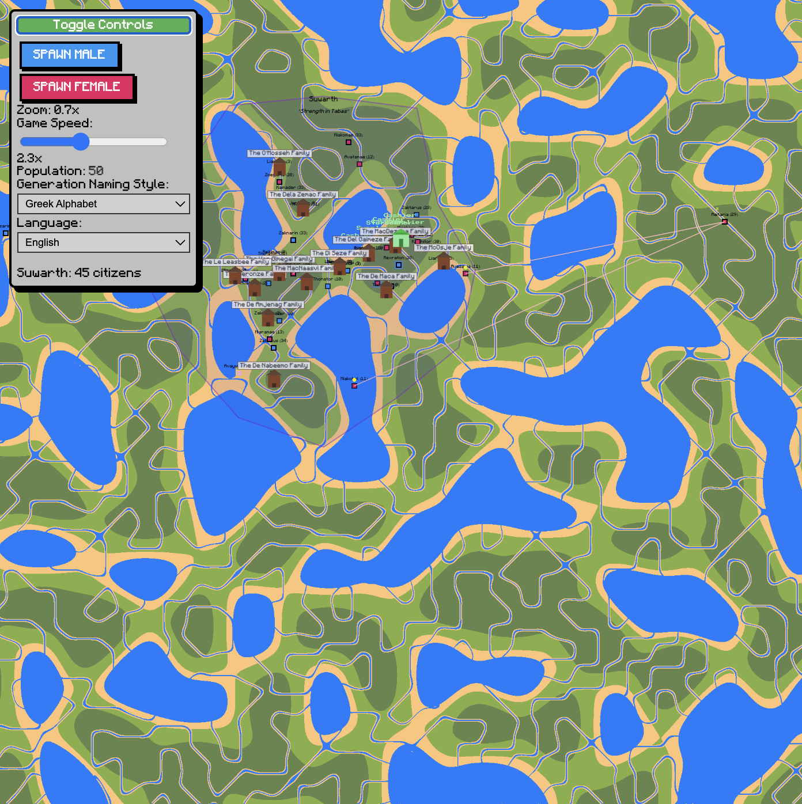

# Sim Civilization

A browser-based civilization simulation game where you can spawn and observe the growth of a virtual society. Watch as your citizens build relationships, establish towns, develop infrastructure, and create a living, breathing world.

Sim-civilization is an engaging simulation that lets you play god and watch your society evolve organically through the interactions of its citizens.

## Features

- **Population Growth**: Spawn male and female citizens who can form relationships and have children
- **Dynamic Town Formation**: Watch as citizens establish towns with unique names and mottos
- **Infrastructure Development**: Citizens will automatically:
  - Build roads between important locations
  - Construct bridges over water
  - Create homes for new families
  - Establish stores and businesses

- **Social Systems**:
  - Mayors are elected in towns
  - Children play games like tag and rock-paper-scissors
  - Citizens have jobs (Engineers, Pavers, Bridgemen, Store owners, etc.)
  - Family lineages and generations are tracked

- **Real-time Statistics**:
  - Population counter
  - Birth rate tracking
  - FPS monitoring
  - Generation naming system

## How to Play

1. **Starting the Game**:
   - Open `index.html` in a web browser
   - Use the control panel in the top-left corner

2. **Basic Controls**:
   - Click "Spawn Male" or "Spawn Female" to add new citizens
   - Click anywhere on land (not water) to place the citizen
   - Use mouse wheel to zoom in/out
   - Click and drag to pan the view

3. **Game Speed**:
   - Adjust the game speed slider (0.5x to 5.0x)
   - Monitor FPS in the ping regulator

4. **Viewing Information**:
   - Toggle the People List to see detailed information about all citizens
   - Click on citizens to see their thoughts
   - Watch the birth chart for population growth statistics

5. **Customization**:
   - Change generation naming styles (Greek, Hebrew, NATO, etc.)
   - Switch between different languages (English, Filipino/Tagalog, Japanese, Spanish)

## Special Features

- **Traits System**: Citizens may have special traits like:
  - Fertile: Increased chance of having twins
  - Fast: Moves more quickly
  - Giant: Larger size
  - Autistic: Unique behavior patterns
  - PTSD: Affected by past events

- **Town Development**:
  - Towns grow organically as population increases
  - Each town has a unique name and motto
  - Mayors are selected based on age and lineage
  - Public buildings and stores appear as towns grow

## Tips

- Place citizens near each other to encourage interaction
- Watch for town formation when families establish homes
- Monitor the birth rate to track population growth
- Keep an eye on infrastructure development (roads, bridges)
- Observe how children interact and play games together

## Technical Notes

- The game uses pixel-perfect rendering for retro-style graphics
- Custom Mojangles font for text display
- Responsive design that works on different screen sizes
- Performance optimization through FPS regulation 